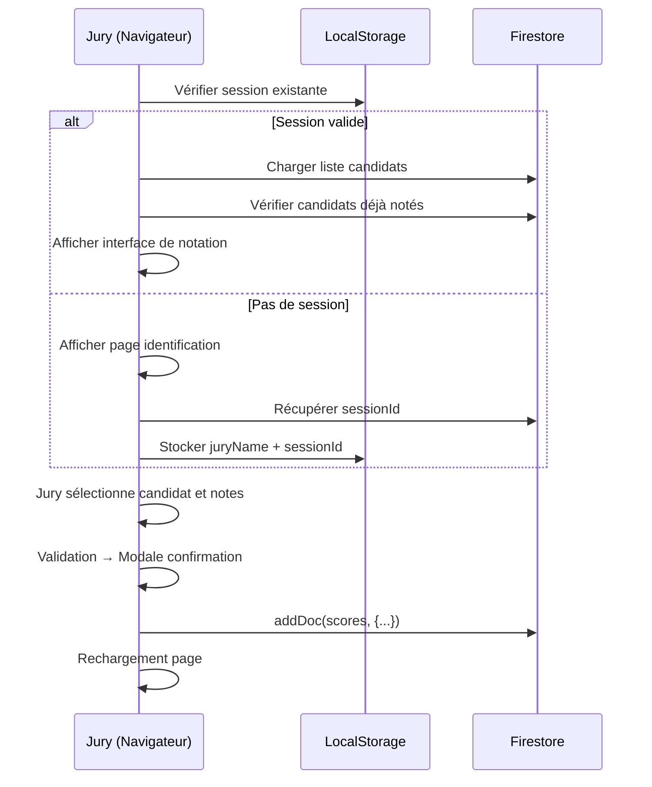
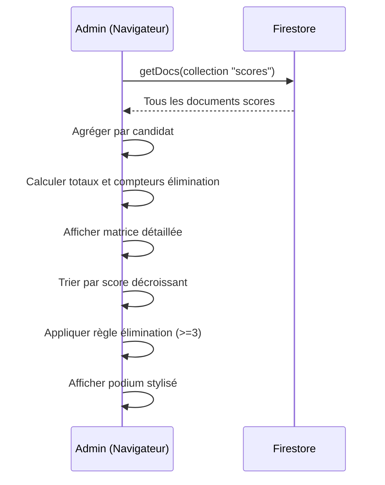

# Spécification Technique - Application de Notation pour Concours d'Éloquence

## Vue d'ensemble

Application web de notation en temps réel destinée aux concours d'éloquence. Elle permet à plusieurs membres de jury de noter indépendamment des candidats selon deux critères pondérés, avec calcul automatique des résultats et classement officiel.

## Architecture Technique

### Stack Technologique
- **Frontend**: HTML5, CSS3, JavaScript Vanilla (ES6 Modules)
- **Backend**: Firebase Firestore (base de données NoSQL en temps réel)
- **Hébergement**: Application statique compatible avec Firebase Hosting ou tout serveur web
- **Dépendances externes**:
  - Firebase SDK 10.1.0 (via CDN)
  - html2canvas (pour export image du podium)

### Structure des Fichiers
```
/
├── index.html          # Interface jury (notation)
├── admin.html          # Interface administrateur (gestion et résultats)
├── script.js           # Logique métier jury
├── style.css           # Styles interface jury
├── firebase-init.js    # Configuration Firebase
└── SPEC.md            # Ce document
```

## Modules Fonctionnels

### 1. Module Jury (index.html + script.js)

#### 1.1 Identification du Jury
**Fonctionnalité**: Authentification simple par nom/identifiant

**Workflow**:
1. Jury saisit son nom/identifiant (min 2 caractères)
2. Validation et récupération de l'ID de session Firebase
3. Stockage en localStorage (`currentJuryName`, `sessionId`)
4. Redirection automatique vers interface de notation

**Persistance**: 
- Session maintenue après rechargement de page
- Reset automatique si l'admin réinitialise les scores (via changement de `sessionId`)

**Code clé**:
- Fonction: `checkSessionAndStart()` - Vérifie la cohérence session locale/Firebase
- Fonction: `logout()` - Efface localStorage et recharge la page

#### 1.2 Interface de Notation

**Éléments d'interface**:
- Sélecteur de candidat (dropdown)
- Grille de notation Fond/Argumentation (coefficient 3)
- Grille de notation Forme/Éloquence (coefficient 1)
- Bouton de validation (désactivé tant que sélection incomplète)
- Bouton de déconnexion

**Grilles de Notation**:
- **Valeurs disponibles**: 5, 10, 15, 20, "Éliminé"
- **Design**: Boutons cliquables avec état sélectionné (vert)
- **Exclusivité**: Un seul bouton sélectionnable par critère

#### 1.3 Système de Prévention des Doublons
- Les candidats déjà notés par le jury courant sont désactivés dans le sélecteur
- Requête Firestore: `where("juryName", "==", currentJuryName)` pour récupérer les scores existants

#### 1.4 Calcul des Scores
**Formule de pondération**:
```javascript
Score Total = (Score Fond × 3) + (Score Forme × 1)
```

**Gestion des Éliminations**:
- Si un des deux critères est "Éliminé" → Score total = 0
- Note: Le système n'empêche pas de mettre "Éliminé" sur un seul critère

#### 1.5 Modale de Confirmation
- Affichage récapitulatif avant envoi:
  - Nom du candidat
  - Note Fond
  - Note Forme
- Boutons: "Confirmer" (vert) / "Annuler" (gris)

#### 1.6 Envoi des Données
**Structure du document Firestore** (collection `scores`):
```javascript
{
  juryName: string,           // Nom du jury
  candidateId: string,        // ID candidat (ex: "C1", "C2"...)
  score1: number|"Elimine",   // Note Fond
  score2: number|"Elimine",   // Note Forme
  totalWeightedScore: number, // Score pondéré calculé
  timestamp: Date             // Horodatage de la notation
}
```

**Post-envoi**: Rechargement automatique de la page pour actualiser la liste des candidats

---

### 2. Module Administration (admin.html)

Interface tout-en-un pour la gestion complète du concours.

#### 2.1 Gestion des Candidats

**Fonctionnalités**:
- Zone de texte libre pour saisir les candidats (un nom par ligne)
- Bouton "Sauvegarder la Liste" qui génère automatiquement les IDs

**Génération des IDs**:
```javascript
// Candidat ligne 1 → C1, ligne 2 → C2, etc.
const list = names.map((n, i) => ({ id: `C${i+1}`, name: n }));
```

**Stockage Firestore** (document unique):
```javascript
Collection: "candidats"
Document: "liste_actuelle"
Structure: {
  candidates: [
    { id: "C1", name: "Nom Candidat 1" },
    { id: "C2", name: "Nom Candidat 2" },
    ...
  ]
}
```

**Comportement**: Rechargement automatique après sauvegarde

#### 2.2 Calcul et Affichage des Résultats

##### 2.2.1 Matrice des Scores (Tableau Détaillé)

**Déclenchement**: Bouton "Charger et Calculer"

**Logique d'agrégation** (fonction `loadAllScores()`):
1. Récupération de tous les documents de la collection `scores`
2. Création d'une structure `aggregatedData` par candidat:
```javascript
{
  candidateId: {
    name: string,
    total: number,          // Somme des scores pondérés (sauf éliminé)
    juryScores: {           // Détail par jury
      "Jury 1": { score1, score2, totalWeightedScore },
      "Jury 2": { ... }
    },
    elimCount: number,      // Nombre de jurys ayant éliminé
    hasScores: boolean      // A au moins un score
  }
}
```

**Affichage du tableau**:
- Colonnes: Candidat | Jury 1 | Jury 2 | ... | Total
- Format cellule jury:
  - Si éliminé: cellule rouge avec "ÉLIMINÉ"
  - Sinon: deux lignes (score1 | score2) + score pondéré en gras
- Colonne Total: fond jaune, score en gras

##### 2.2.2 Classement Officiel (Podium)

**Règles de Classement**:
1. Tri décroissant par `total` (somme des scores pondérés)
2. **Règle d'élimination**: Si `elimCount >= 3` → Candidat éliminé (hors classement)

**Styles visuels**:
- 🥇 Rang 1: Fond doré (`gold`)
- 🥈 Rang 2: Fond argenté (`silver`)
- 🥉 Rang 3: Fond bronze (`#cd7f32`)
- ❌ Éliminés: Fond gris foncé avec mention "ÉLIMINÉ (X jurys)"

**Colonnes**: Rang | Candidat | Score Pondéré | Statut

#### 2.3 Export des Données

##### Export Excel (CSV)
**Fonctionnalité**: Bouton "Excel (.csv)" (fonction `exportToExcel()` - non implémentée dans le code actuel)
**Note**: La fonction est référencée mais son implémentation n'est pas présente dans le code fourni.

##### Export Podium (Image)
**Fonctionnalité**: Bouton "Podium (Image)" (fonction `exportPodiumToImage()` - non implémentée)
**Dépendance**: html2canvas.js est chargé pour cette fonctionnalité
**Note**: La fonction est référencée mais son implémentation n'est pas présente dans le code fourni.

#### 2.4 Zone de Danger - Réinitialisation

**Fonctionnalité**: Suppression totale de tous les scores

**Workflow**:
1. Bouton rouge "RÉINITIALISER TOUS LES SCORES"
2. Confirmation JavaScript (`confirm()`)
3. Suppression de tous les documents de la collection `scores`
4. Rechargement automatique de la page

**Code clé**:
```javascript
const snap = await getDocs(collection(db, "scores"));
for (const d of snap.docs) { 
  await deleteDoc(doc(db, "scores", d.id)); 
}
```

**Note**: Les candidats ne sont PAS supprimés, seulement les scores

---

### 3. Module Persistance (firebase-init.js)

#### Configuration Firebase
**Fichier**: `firebase-init.js`
**Rôle**: Initialisation unique de la connexion Firebase

**Configuration actuelle**:
```javascript
projectId: "concours-eloquence-2025"
```

**Export**: Instance Firestore (`db`) utilisée par tous les modules

#### Structure de la Base de Données Firestore

##### Collection `scores`
Documents auto-générés avec structure:
```javascript
{
  juryName: string,
  candidateId: string,
  score1: number|"Elimine",
  score2: number|"Elimine",
  totalWeightedScore: number,
  timestamp: Date
}
```

##### Collection `candidats`
Document unique `liste_actuelle`:
```javascript
{
  candidates: [
    { id: string, name: string },
    ...
  ]
}
```

##### Collection `config` (optionnelle)
Document `session` pour gestion du reset:
```javascript
{
  current_id: string  // ID de session (changé lors d'un reset)
}
```

---

## Flux de Données

### Workflow Complet d'une Notation



### Workflow Calcul des Résultats



---

## Règles Métier

### Règles de Notation
1. **Grille de notes**: Strictement limitée à 5, 10, 15, 20 ou "Éliminé"
2. **Pondération**: Fond (×3) / Forme (×1)
3. **Élimination partielle**: Possible de mettre "Éliminé" sur un seul critère
4. **Élimination totale**: Si au moins un critère éliminé → Score = 0
5. **Unicité**: Un jury ne peut noter qu'une seule fois chaque candidat

### Règles de Classement
1. **Tri**: Décroissant par somme des scores pondérés
2. **Élimination définitive**: Si `elimCount >= 3` → Hors classement
3. **Podium**: Top 3 des candidats non éliminés
4. **Affichage éliminés**: Listés en bas du tableau sans rang

### Règles de Session
1. **Persistance**: Session jury conservée en localStorage
2. **Invalidation**: Reset automatique si l'ID de session Firebase change
3. **Déconnexion manuelle**: Bouton logout efface localStorage et recharge

---

## Styles et UX

### Design System (style.css)

#### Palette de Couleurs
- **Primaire**: `#007bff` (Bleu) - Titres, bouton principal
- **Succès**: `#28a745` (Vert) - Validation, sélection active
- **Danger**: `#dc3545` (Rouge) - Élimination, suppression
- **Warning**: `#ffc107` (Jaune) - Validation finale, totaux
- **Neutre**: `#6c757d` (Gris) - Annulation, éléments désactivés

#### Composants Clés

**Boutons de Score**:
- Taille: `font-size: 1.8em`, `padding: 25px`
- Grille 2×2 + bouton "Éliminé" en pleine largeur
- État sélectionné: Fond vert (`#28a745`), bordure foncée

**Modale de Confirmation**:
- Overlay semi-transparent (`rgba(0,0,0,0.4)`)
- Contenu centré avec ombre portée
- Largeur max: 500px

**Tableaux Admin**:
- Bordures grises `#ddd`
- Ombres légères (`box-shadow: 0 2px 4px rgba(0,0,0,0.1)`)
- Alternance de couleurs selon le rang

### Responsiveness
- **Cible principale**: Tablettes (design optimisé pour usage tactile)
- **Conteneur principal**: Max-width 1000px, centré
- **Boutons**: Taille tactile (min 25px padding)
- **Flex-wrap**: Adaptation automatique sur petits écrans

---

## Sécurité et Limitations

### Points de Sécurité
⚠️ **Configuration Firebase exposée**: Les clés API sont en clair dans le code frontend
- **Impact**: Configuration Firebase publique (standard pour applications web)
- **Recommandation**: Utiliser les règles de sécurité Firestore pour restreindre les accès

### Règles Firestore Recommandées
```javascript
rules_version = '2';
service cloud.firestore {
  match /databases/{database}/documents {
    // Lecture seule pour les candidats
    match /candidats/{document} {
      allow read: if true;
      allow write: if false; // Seulement via admin.html
    }
    
    // Scores: lecture libre, écriture avec validation
    match /scores/{document} {
      allow read: if true;
      allow create: if request.resource.data.juryName is string
                    && request.resource.data.candidateId is string;
      allow update, delete: if false;
    }
    
    // Config: lecture seule
    match /config/{document} {
      allow read: if true;
      allow write: if false;
    }
  }
}
```

### Limitations Connues
1. **Pas d'authentification forte**: Système basé sur l'honneur (nom saisi)
2. **Pas de modification de score**: Une fois envoyé, impossible de corriger
3. **Pas de gestion des doublons sur même nom**: Si deux jurys ont le même nom, collision
4. **Export CSV/Image**: Fonctions référencées mais non implémentées
5. **Pas de validation des noms de candidats**: Accepte lignes vides, doublons

---

## Améliorations Possibles

### Court Terme
- [ ] Implémenter les fonctions d'export (CSV, Image)
- [ ] Ajouter confirmation avant déconnexion
- [ ] Validation des noms de candidats (éviter doublons/vides)
- [ ] Message de chargement pendant les opérations Firebase
- [ ] Gestion des erreurs réseau plus robuste

### Moyen Terme
- [ ] Authentification Firebase Auth (email/password)
- [ ] Modification de scores (avec historique)
- [ ] Interface mobile responsive améliorée
- [ ] Statistiques avancées (moyennes par jury, écarts-types)
- [ ] Export PDF du podium

### Long Terme
- [ ] Mode multi-concours (gestion de plusieurs événements)
- [ ] Dashboard temps réel avec WebSocket/Realtime updates
- [ ] Commentaires textuels par jury
- [ ] Système de notification (jury en attente, etc.)
- [ ] Application mobile native (React Native/Flutter)

---

## Tests et Développement Local

### Vue d'ensemble

L'application peut être testée localement avant tout commit ou déploiement. Deux approches sont disponibles selon vos besoins.

### Méthode 1: Serveur Local + Firebase Production (Simple)

**Avantages**: Configuration minimale, test de l'intégration réelle
**Inconvénients**: Utilise la vraie base de données (données de test mélangées avec production)

```bash
# Démarrer un serveur web local
python3 -m http.server 8000

# OU avec Node.js
npx http-server -p 8000
```

**Accès**:
- Interface jury: http://localhost:8000/index.html
- Interface admin: http://localhost:8000/admin.html

### Méthode 2: Firebase Emulator Suite (Recommandée pour Tests)

**Avantages**: Données complètement isolées, pas de quota consommé, interface de debug
**Inconvénients**: Nécessite installation de Firebase CLI

#### Installation
```bash
npm install -g firebase-tools
```

#### Configuration

Les fichiers `firebase.json` et `.firebaserc` sont déjà configurés dans le projet.

Pour activer le mode émulateur, décommenter dans `firebase-init.js`:

```javascript
const USE_EMULATOR = window.location.hostname === 'localhost' 
                  || window.location.hostname === '127.0.0.1';

if (USE_EMULATOR) {
  connectFirestoreEmulator(db, 'localhost', 8080);
  console.log('🔥 MODE ÉMULATEUR ACTIVÉ');
}
```

#### Démarrage
```bash
# Dans le dossier du projet
firebase emulators:start

# Services disponibles:
# - Hosting: http://localhost:5000
# - Firestore: localhost:8080
# - Interface admin: http://localhost:4000
```

#### Interface Emulator
L'interface web http://localhost:4000 permet de:
- Visualiser les collections Firestore en temps réel
- Inspecter les documents
- Supprimer/modifier les données de test
- Voir les logs des requêtes

### Scénarios de Test Recommandés

Voir le fichier `TESTING.md` pour une liste complète des scénarios de test et une checklist avant commit.

**Tests essentiels**:
1. ✅ Identification jury + persistance session
2. ✅ Notation normale (scores 5/10/15/20)
3. ✅ Notation avec élimination
4. ✅ Prévention des doublons (même candidat par même jury)
5. ✅ Calcul des résultats et podium
6. ✅ Règle d'élimination définitive (≥3 jurys)
7. ✅ Déconnexion et reset de session
8. ✅ Responsive design (DevTools > Device Mode)

### Debug et Inspection

**Chrome/Firefox DevTools** (`Cmd+Option+I` ou `F12`):
- **Console**: Erreurs JavaScript
- **Network**: Requêtes Firebase
- **Application**: localStorage, cookies
- **Device Mode**: Test responsive

**Firebase Emulator UI** (si émulateur actif):
- http://localhost:4000
- Inspection complète de Firestore
- Logs des opérations

### Fichiers de Test

Les fichiers suivants sont dans `.gitignore` et ne seront pas commités:
- `*-test.html` - Copies de test des pages HTML
- `*-emulator.js` - Scripts configurés pour émulateur
- `test-data/` - Export de données de test
- `.firebase/` - Cache Firebase CLI

### Export/Import Données de Test

Pour créer des jeux de données réutilisables:

```bash
# 1. Démarrer émulateur
firebase emulators:start

# 2. Créer des données via l'interface web

# 3. Exporter (dans un autre terminal)
firebase emulators:export ./test-data

# 4. Réimporter ultérieurement
firebase emulators:start --import=./test-data
```

### Switch Production ↔ Émulateur

**Pour passer en mode émulateur**: Décommenter le bloc dans `firebase-init.js`
**Pour revenir en production**: Recommenter le bloc

**Alternative**: Utiliser des profils de configuration ou variables d'environnement

### Checklist Avant Commit

Avant de committer des modifications:
- [ ] Tests passés avec succès (voir TESTING.md)
- [ ] Aucune erreur dans la console navigateur
- [ ] `firebase-init.js` configuré en mode PRODUCTION
- [ ] Pas de `console.log()` de debug oubliés
- [ ] Code formaté et indenté proprement
- [ ] Fichiers de test non inclus dans le commit

---

## Guide de Déploiement

### Prérequis
1. Compte Firebase avec projet créé
2. Firestore activé en mode "production" ou "test"
3. Serveur web (Firebase Hosting recommandé)

### Étapes de Déploiement

#### 1. Configuration Firebase
1. Créer un projet sur [Firebase Console](https://console.firebase.google.com)
2. Activer Firestore Database
3. Copier les clés de configuration dans `firebase-init.js`

#### 2. Déploiement Firebase Hosting (Recommandé)
```bash
# Installation Firebase CLI
npm install -g firebase-tools

# Connexion à Firebase
firebase login

# Initialisation du projet
firebase init hosting

# Sélectionner le projet créé
# Définir le dossier public: . (racine)
# Configuration SPA: Non
# Déploiement automatique GitHub: Optionnel

# Déploiement
firebase deploy --only hosting
```

#### 3. Alternative: Serveur Web Simple
```bash
# Python 3
python -m http.server 8000

# Node.js (avec http-server)
npx http-server -p 8000
```

### Configuration Post-Déploiement
1. Ouvrir `admin.html` et créer la liste des candidats
2. (Optionnel) Créer document `config/session` avec `{current_id: "1"}`
3. Partager l'URL de `index.html` aux membres du jury

---

## Maintenance

### Réinitialisation entre Concours
1. Ouvrir `admin.html`
2. Utiliser "RÉINITIALISER TOUS LES SCORES"
3. Mettre à jour la liste des candidats
4. (Optionnel) Incrémenter `config/session.current_id` pour invalider toutes les sessions jury

### Sauvegarde des Données
**Méthode 1**: Export Firestore (Console Firebase)
- Aller dans Firestore → Export/Import
- Exporter au format JSON

**Méthode 2**: Script Node.js
```javascript
// Exemple de backup script
const admin = require('firebase-admin');
// ... initialisation admin SDK
// ... backup collections vers fichiers JSON
```

### Monitoring
- Console Firebase → Firestore → Onglet "Usage"
- Surveiller: Lectures, Écritures, Suppressions par jour
- Quota gratuit: 50k lectures/jour, 20k écritures/jour

---

## Support et Contact

### Informations Projet
- **Nom**: Application Concours Éloquence 2025
- **Version**: 1.0
- **Date**: 2025
- **Langage**: Français (France)

### Technologies
- Firebase SDK: 10.1.0
- html2canvas: Latest (via CDN)
- ES6 Modules: Supporté par navigateurs modernes

### Compatibilité Navigateurs
- ✅ Chrome/Edge 90+
- ✅ Firefox 88+
- ✅ Safari 14+
- ⚠️ Internet Explorer: Non supporté (nécessite ES6 Modules)

---

## Annexes

### A. Structure Complète des Collections Firestore

```
concours-eloquence-2025 (Projet Firebase)
│
├── candidats (Collection)
│   └── liste_actuelle (Document)
│       └── candidates: [
│           { id: "C1", name: "Candidat 1" },
│           { id: "C2", name: "Candidat 2" }
│         ]
│
├── scores (Collection)
│   ├── [auto-id-1] (Document)
│   │   ├── juryName: "Mme. Dupont"
│   │   ├── candidateId: "C1"
│   │   ├── score1: 15
│   │   ├── score2: 20
│   │   ├── totalWeightedScore: 65
│   │   └── timestamp: 2025-01-15T10:30:00Z
│   │
│   └── [auto-id-2] (Document)
│       └── ...
│
└── config (Collection - Optionnelle)
    └── session (Document)
        └── current_id: "1"
```

### B. Glossaire

- **Coefficient**: Multiplicateur appliqué au score d'un critère
- **Élimination partielle**: Un seul critère éliminé (score total = 0 quand même)
- **Élimination définitive**: 3 jurys ou plus ont mis "Éliminé" → Hors classement
- **Score pondéré**: `(Score1 × Coeff1) + (Score2 × Coeff2)`
- **Session ID**: Identifiant unique incrémenté à chaque reset admin

### C. Exemples de Calculs

**Exemple 1**: Notation normale
- Fond: 15 (×3) = 45 points
- Forme: 10 (×1) = 10 points
- **Total: 55 points**

**Exemple 2**: Élimination partielle
- Fond: "Éliminé"
- Forme: 20
- **Total: 0 point**

**Exemple 3**: Classement avec éliminations
```
Candidat A: 180 points, 0 élimination → Rang 1 🥇
Candidat B: 165 points, 1 élimination → Rang 2 🥈
Candidat C: 190 points, 3 éliminations → ÉLIMINÉ ❌
Candidat D: 140 points, 2 éliminations → Rang 3 🥉
```

---

**Fin de la spécification technique**

*Document généré automatiquement le 22 décembre 2025*

